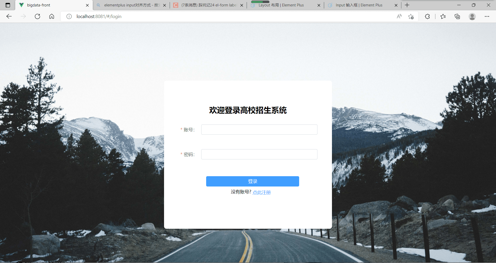
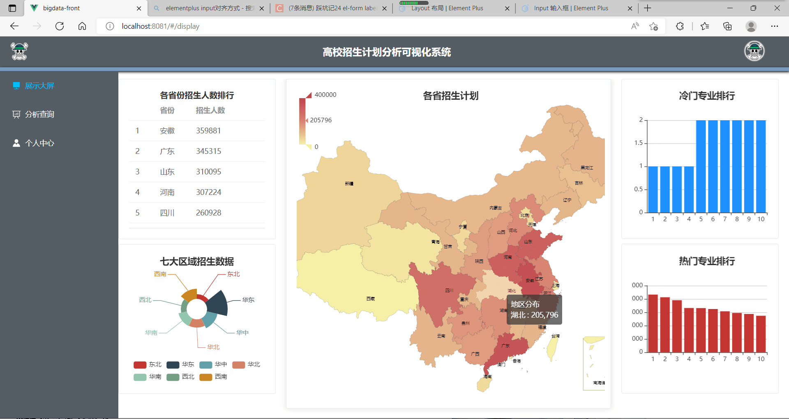
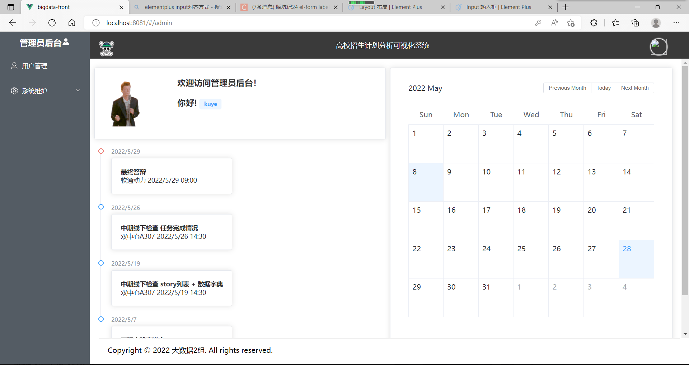
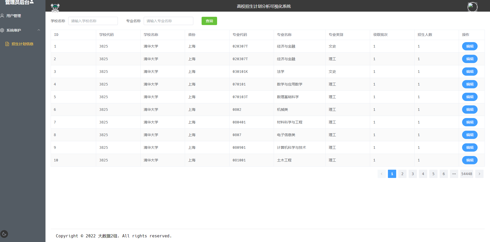
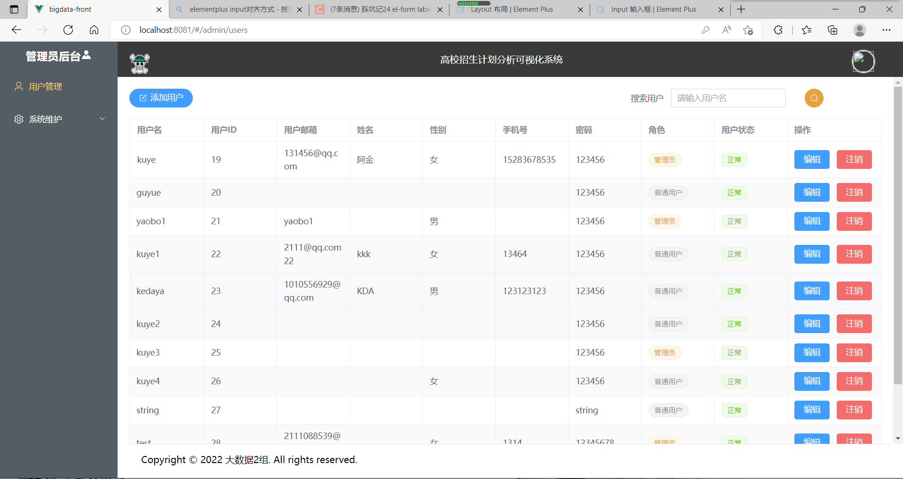
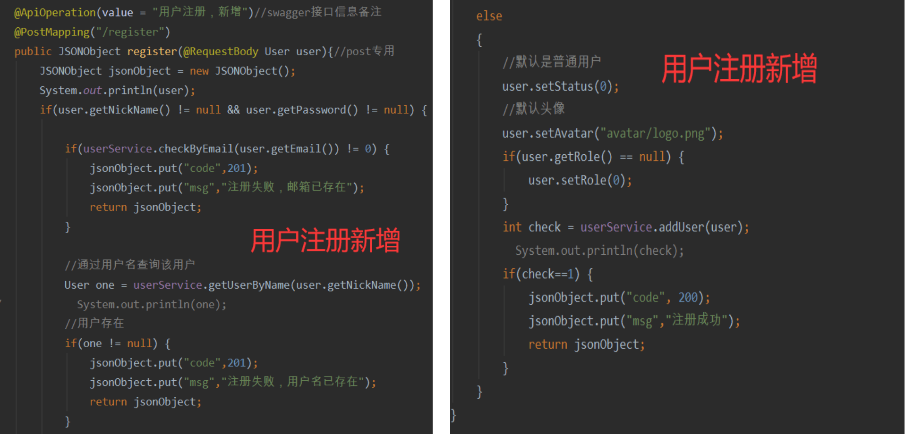
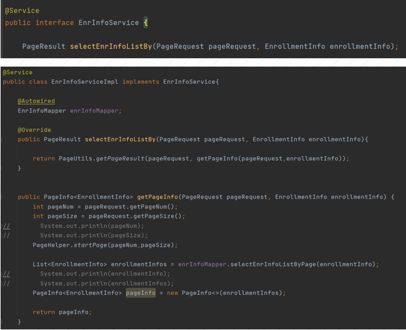
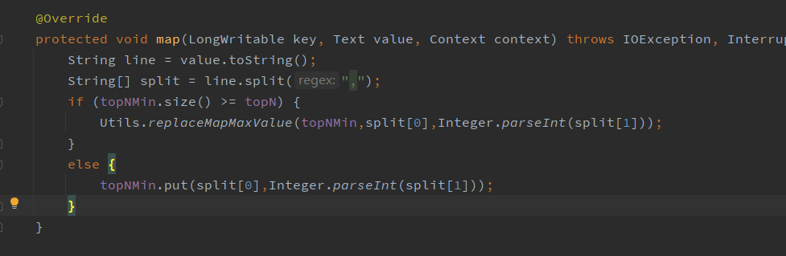
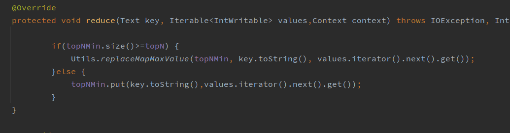

A simple *Hadoop* based distributed big data visulization analysis web system.

*using students university enrollment data of China*

Tech Stack：

- Front-end：Vue.js + ECharts
- Back-end：SpringBoot + Hadoop + Mysql

## Front-end

Users

- normal user
- system administrator

responding to different UI and available operations

### User

### Admin

### Java + SpringBoot

## Hadoop

Map + Reduce

